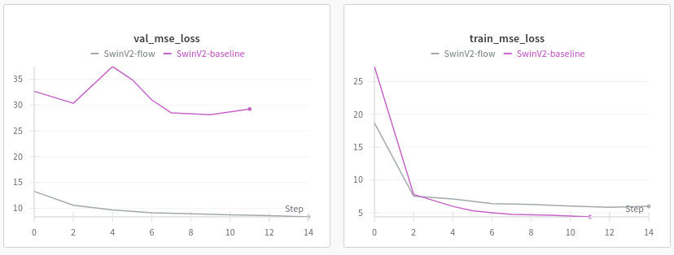

Welcome to the comma.ai Programming Challenge!
======

Your goal is to predict the speed of a car from a video.

- data/train.mp4 is a video of driving containing 20400 frames. Video is shot at 20 fps.
- data/train.txt contains the speed of the car at each frame, one speed on each line.
- data/test.mp4 is a different driving video containing 10798 frames. Video is shot at 20 fps.

Deliverable
-----

Your deliverable is test.txt. E-mail it to givemeajob@comma.ai, or if you think you did particularly well, e-mail it to George.

Evaluation
-----

We will evaluate your test.txt using mean squared error. <10 is good. <5 is better. <3 is heart.

---

# Solution

## Architectures

###  Swin Transformer Baseline

- Uses Swin V2 backbone to process 8-frame video sequences
- Global average pooling over spatial dimensions, followed by temporal pooling
- MLP head for speed regression

###  Dual-Stream Swin + Optical Flow

- Two parallel Swin V2 encoders: one for RGB frames, one for optical flow
- Optical flow computed using Farneback algorithm between consecutive frames
- Features concatenated and passed through MLP for final prediction

## Results 

Setup: NVIDIA T4 GPU

Test MSE: ~8.2 (evaluated on test split from the original training video and labels using 60/20/20 split)

PS: The training only went up to 8 epochs and approximately 5 hours... spot GPUs are quite cheap, but not free, so I could do better but settled for good. (The numbers could be different on the real test set though.)

## Analysis
While it was expected that optical flow would improve performance - motion features are directly relevant to speed estimation - I wanted to quantify how significant this difference would be. The results show a substantial gap: the pure vision transformer struggles to generalize despite having access to the same temporal information.
This performance difference highlights that while vision transformers excel at learning spatial patterns, speed estimation is fundamentally a temporal task requiring motion understanding. Optical flow provides a direct encoding of pixel displacement between frames. 

The pure transformer approach would likely require significantly more data and training to implicitly learn these motion representations that optical flow provides explicitly. Vision Mamba architectures could be better positioned for this task as their state-space modeling inherently maintains temporal state across sequences, potentially capturing motion dynamics more naturally than attention-based transformers.

## Possible Future Directions
- Experiment with different motion representations (frame differences, 3D convolutions)
- Cross-attention fusion instead of concatenation
- Explore state-space models like Vision Mamba, which might better capture temporal dynamics through their recurrent structure

